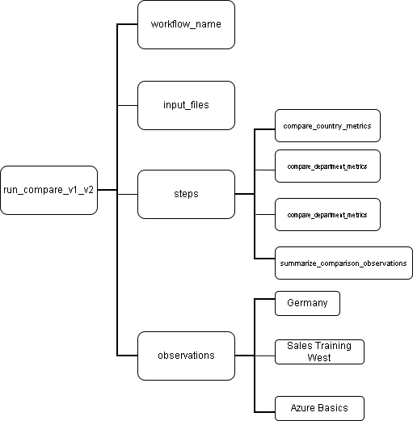
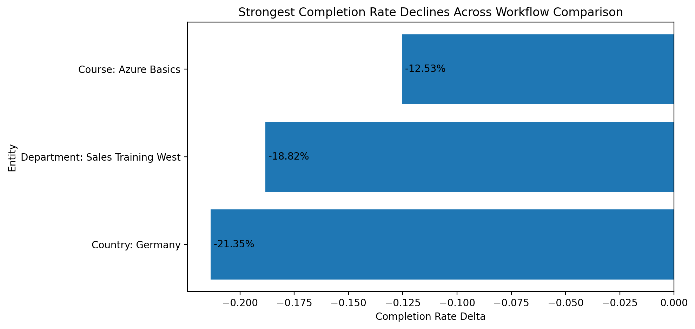

# Tracing AI-Assisted Analytics Workflows: A Provenance-Based Approach to Reproducibility

## Overview

This project is a lightweight prototype for studying **traceability** and **reproducibility** in automated analytics workflows. It is inspired by real reporting pipelines in corporate learning and business analytics contexts, where results are produced through multiple steps such as data ingestion, preprocessing, aggregation, comparison, and summary generation.

The main goal is to explore a simple question:

**When an analytics result changes across workflow runs, can we trace what changed, where it changed, and how it affected the final output?**

To study this, the project simulates two versions of a learning analytics dataset, processes them through the same workflow, compares the resulting metrics, and records structured provenance for the main workflow steps.

---

## Motivation

In many reporting and analytics environments, final outputs such as dashboards, summaries, or performance indicators are the result of several intermediate processing steps. Once the workflow becomes automated, it can become difficult to answer questions such as:

- Which dataset version produced this result?
- Which transformation or aggregation step influenced the output?
- Why did the reported completion rate change between two runs?
- Which entities were most affected by the new dataset version?
- Can the workflow results be reproduced and interpreted consistently?

This project addresses these questions through a small reproducible prototype based on:

- synthetic learning analytics data
- workflow-level aggregation and comparison
- simple provenance tracking through JSON records

---

## Research Focus

This prototype is guided by the following questions:

1. **Which workflow elements should be recorded to make analytics outputs traceable?**
2. **How can structured provenance help compare different workflow runs?**
3. **Can provenance improve reproducibility and interpretation in analytics workflows?**

The project does not attempt to solve these questions fully. Its purpose is to provide a small, concrete experimental setup in which such questions can be explored.

---

## Project Scenario

The workflow is inspired by an automated learning reporting pipeline.

Each row in the dataset represents one learner-course record with information such as:

- learner identifier
- country
- department
- course name
- learning status
- progress
- time spent
- enrollment and activity dates
- dataset version

Two synthetic datasets are generated:

- **Version 1**: baseline dataset
- **Version 2**: updated dataset with simulated performance shifts

The updated version introduces structured changes so that workflow comparison becomes meaningful. In particular, the second dataset simulates a decline affecting:

- **Germany** at country level
- **Sales Training West** at department level
- **Azure Basics** at course level

This allows the workflow to produce measurable differences across runs.

---

## Workflow Structure

The full workflow consists of the following steps:


1. **Generate synthetic datasets**
2. **Run basic data checks**
3. **Aggregate metrics by country, department, and course**
4. **Compare aggregated outputs across dataset versions**
5. **Record provenance for aggregation and comparison steps**
6. **Generate a short text summary of the comparison**

This structure reflects a simplified but realistic reporting workflow.

---

## Repository Structure

```text
provenance-analytics-workflow/
├── README.md
├── requirements.txt
├── data/
│   ├── sample_learning_data.csv
│   └── sample_learning_data_v2.csv
├── outputs/
│   ├── v1_country_metrics.csv
│   ├── v1_department_metrics.csv
│   ├── v1_course_metrics.csv
│   ├── v1_top_anomalies.csv
│   ├── v1_overall_summary.csv
│   ├── v2_country_metrics.csv
│   ├── v2_department_metrics.csv
│   ├── v2_course_metrics.csv
│   ├── v2_top_anomalies.csv
│   ├── v2_overall_summary.csv
│   ├── compare_country_metrics.csv
│   ├── compare_department_metrics.csv
│   ├── compare_course_metrics.csv
│   ├── provenance_v1_aggregation.json
│   ├── provenance_v2_aggregation.json
│   ├── provenance_compare.json
│   └── management_summary.txt
├── report/
│   └── mini_report.md
└── src/
    ├── generate_sample_data.py
    ├── check_data.py
    ├── aggregate.py
    ├── compare_aggregates.py
    ├── provenance.py
    ├── summarize.py
    └── run_pipeline.py
```

---

## Main Scripts

`generate_sample_data.py`

Generates two synthetic datasets:

* sample_learning_data.csv
* sample_learning_data_v2.csv

The second dataset simulates a shifted scenario with weaker outcomes for selected entities.

`check_data.py`

Runs basic descriptive checks on both datasets to verify that the simulated version shift is visible.

`aggregate.py`

Aggregates the input data by:

* country
* department
* course

It computes metrics such as:

* learner count
* completion rate
* completion gap vs overall
* active learner ratio
* average progress
* average time spent
* missing hours ratio

It also extracts top anomalies for each dataset version.

`compare_aggregates.py`

Compares the aggregated outputs from version 1 and version 2 and computes deltas across dimensions.

`provenance.py`

Provides helper functions for creating and saving structured provenance records in JSON format.

`summarize.py`

Builds a short text summary from the comparison outputs and provenance record.

`run_pipeline.py`
Executes the full workflow from data generation to summary production.

---

## Dataset Description

The synthetic dataset includes the following fields:

* `user_id`
* `country`
* `department`
* `course_name`
* `course_category`
* `status`
* `progress_pct`
* `completion_date`
* `time_spent_hours`
* `last_activity_date`
* `enrollment_date`
* `dataset_version`

The records are generated using a simple simulation logic combining:

* course difficulty
* noisy completion probabilities
* structured changes in version 2
* missingness in time spent

The project uses synthetic data so that the workflow can be shared and reproduced without relying on confidential business information.

---

## Output Files

After running the workflow, the main outputs are:

### Aggregation outputs
* `v1_country_metrics.csv`
* `v1_department_metrics.csv`
* `v1_course_metrics.csv`
* `v1_top_anomalies.csv`
* `v1_overall_summary.csv`
* `v2_country_metrics.csv`
* `v2_department_metrics.csv`
* `v2_course_metrics.csv`
* `v2_top_anomalies.csv`
* `v2_overall_summary.csv`
### Comparison outputs
* `compare_country_metrics.csv`
* `compare_department_metrics.csv`
* `compare_course_metrics.csv`
### Provenance outputs
* `provenance_v1_aggregation.json`
* `provenance_v2_aggregation.json`
* `provenance_compare.json`
### Text output
* `management_summary.txt`

---

## Provenance Design

The provenance layer is intentionally lightweight.



Each workflow run is recorded as a JSON object containing:

* `run_id`
* `timestamp`
* `workflow_name`
* `workflow_version`
* `dataset_version`
* `input_files`
* `steps`

Each step records:

* `step_name`
* `step_type`
* `timestamp`
* `input_files`
* `output_files`
* `parameters`
* `row_count_in`
* `row_count_out`
* `observations`

This makes it possible to inspect:

* which files were used
* which outputs were produced
* which groupings or parameters were applied
* which entities were most negatively affected

The provenance design is intentionally simple and does not yet implement a formal ontology or graph model.

---

## Example Workflow Logic

At a high level, the workflow proceeds as follows:

### Version 1
* load baseline dataset
* preprocess fields
* aggregate metrics
* extract anomalies
* save outputs
* save provenance
### Version 2
* load shifted dataset
* preprocess fields
* aggregate metrics
* extract anomalies
* save outputs
* save provenance
### Comparison
* read v1 and v2 aggregated outputs
* merge by dimension
* compute deltas
* identify strongest declines
* save comparison outputs
* save provenance
### Summary
* read comparison outputs
* extract strongest shifts
* generate short textual summary

---

## Main Findings

In the current simulated scenario, the comparison step identifies the following strongest declines:



* Country with the strongest completion decline: Germany (`-21.35%`)
* Department with the strongest completion decline: Sales Training West (`-18.82%`)
* Course with the strongest completion decline: Azure Basics (`-12.53%`)

These findings confirm that the second dataset version creates a meaningful comparison setting and that the workflow is able to recover the intended shifts through aggregation and comparison.

---

## How to Run
1. Install dependencies
```
pip install -r requirements.txt
```
2. Generate the synthetic datasets
```
python src/generate_sample_data.py
```
3. Run basic checks
```
python src/check_data.py
```
4. Aggregate metrics for both dataset versions
```
python src/aggregate.py
```
5. Compare aggregated outputs
```
python src/compare_aggregates.py
```
6. Generate workflow summary text
```
python src/summarize.py
```
7. Executes the full workflow
```
python src/run_pipeline.py
```

---

## Example Summary Output

A typical generated summary may look like this:
```
Workflow comparison summary
----------------------------------------
Overall completion rate moved from 52.00% to 39.00% (-13.00%).
Average time spent moved from 6.40 to 5.10 hours (-1.30).
The strongest country-level decline is observed in Germany (-21.35%).
The strongest department-level decline is observed in Sales Training West (-18.82%).
The strongest course-level decline is observed in Azure Basics (-12.53%).
These results are associated with comparison run: run_compare_v1_v2.
```

---

## Why This Project Matters

This project is not only about descriptive analytics. Its main contribution is to provide a small experimental setting in which workflow traceability can be studied concretely.

The prototype shows how a workflow can be instrumented so that output differences are not treated as opaque changes, but as results that can be connected to:

* input version changes
* aggregation logic
* comparison procedures
* explicit recorded observations

This makes the workflow easier to inspect, explain, and reproduce.

---

## Limitations

This project has several limitations:

* The data is synthetic.
* The workflow is simplified compared with real production pipelines.
* The provenance model is lightweight and JSON-based.
* The summary step uses a fixed template rather than a more flexible text generation mechanism.
* No formal graph-based provenance model is implemented yet.
* No reproducibility benchmark is included yet beyond simple version comparison.

These limitations are acceptable for a first prototype, but they also indicate clear directions for future work.

---

## Possible Extensions

The project can be extended in several directions:

1. Richer provenance representation
    * graph-based provenance
    * PROV-inspired schema
    * entity-step dependency visualization
2. Stronger reproducibility analysis
    * repeated runs under changing workflow parameters
    * comparison of multiple dataset versions
    * sensitivity analysis on aggregation rules
3. More complex workflow steps
    * anomaly detection modules
    * rule-based decision layers
    * AI-assisted interpretation steps
4. Better reporting outputs
    * markdown summaries
    * dashboards
    *  structured evidence tables
    * workflow diagrams
5. Cross-domain adaptation
    The same workflow design could be adapted to:
    * learning analytics
    * retail analytics
    * product performance tracking
    * operational reporting

---

## Intended Use

This repository is intended as:

* a small research prototype
* a demonstrator for provenance-aware analytics workflows
* a starting point for future work on reproducibility and workflow interpretation
* a portfolio project aligned with data management and AI research themes

---

## Author Note

This project is based on practical experience with real reporting and analytics workflows in different business settings. The implementation uses synthetic data, but the workflow design is motivated by recurring real-world questions about:

* versioned data
* automated updates
* aggregation logic
* result traceability
* reproducibility across runs

---

## License

This project is shared for academic and portfolio purposes.

